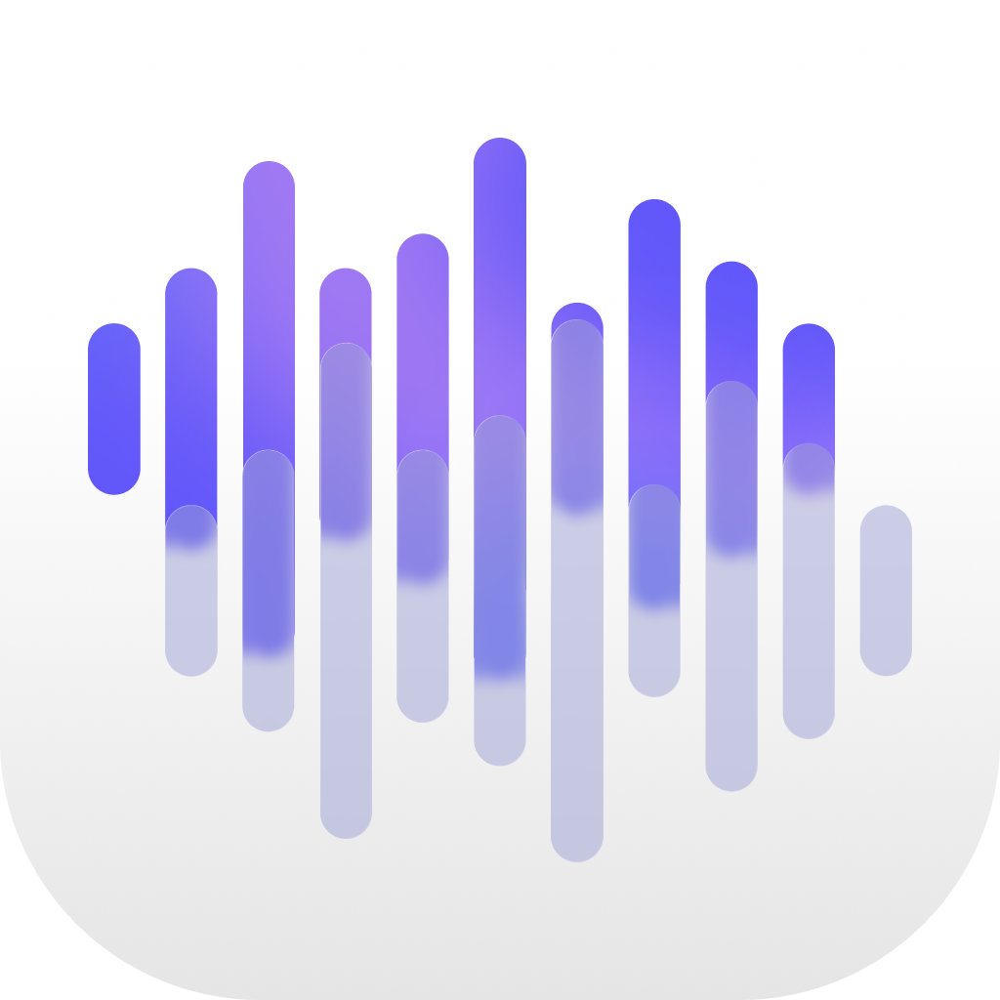

<div align="center">



# Align — free, open-source audio & video sync

**Sync your recordings. Keep your edit.**

Synchronize camera footage and separately recorded audio using waveforms,
timecode, and recording metadata.

[Releases](https://github.com/FedyaLight/align/releases) ·
[User guide](docs/usage.md) ·
[Supported formats](docs/formats.md) ·
[Development](docs/development.md)

[](https://github.com/FedyaLight/align/actions/workflows/align-rs.yml)
[](LICENSE)

</div>

---

Align is a free, open-source alternative to Syncaila and PluralEyes for
synchronizing multicamera footage and external audio. It combines audio waveform
matching, timecode overlap, and links between consecutive recording parts to
place clips on a common timeline.
Use the desktop app to review the result, the CLI for batch jobs, or the MCP
server to connect it to other tools. Original recordings stay untouched.

## From recordings to an edit

1. **Add media** — files, folders, or an XML, FCPXML, or AAF timeline.
2. **Synchronize** — align by sound and available timing metadata, then review groups and unmatched clips.
3. **Export** — open the aligned timeline in your editor.

| Editor | Export formats |
| :--- | :--- |
| Adobe Premiere Pro | FCP 7 XML |
| DaVinci Resolve | XML, OpenTimelineIO, Python import script |
| Final Cut Pro | FCPXML timeline and multicam projects |
| AAF-compatible editors | Linked AAF |

Interchange support varies by format. Effects, transitions, and retiming may not
survive a round trip. Check the [format limits](docs/formats.md) before processing
an existing edit.

## What Align handles

- **Shared audio:** match recordings of the same sound using audio fingerprints
  and waveform refinement.
- **Timecode:** use overlapping source timecodes to connect otherwise unmatched
  clips, including clips without a usable waveform match.
- **Recording metadata:** recognize consecutive parts of a continuous recording
  and use recording timestamps to help resolve ambiguous audio matches.
- **Existing edits:** preserve selected tracks' basic trims, duplicates,
  positions, and gaps while aligning other recordings.
- **Clock drift:** render corrected audio from validated time mappings without
  changing the source files.
- **Separate recordings:** keep unrelated material in separate synchronization
  groups and show clips that could not be matched.
- **Repeat work:** reuse cached fingerprints and save analysis results for later
  export.

### How synchronization works

Align first matches audio, then links recognized consecutive recording parts,
then uses timecode overlap to connect remaining clips. Timecode does not replace
an established audio match. Supported timing sources include container timecode,
BWF/iXML metadata, and LTC recorded on an audio channel; availability depends on
the media and the selected time-source setting.

Recordings need shared sound or usable timing/continuity evidence. Incorrect
device clocks or timecodes can produce incorrect alignments, so review the result
before exporting. See [synchronization settings](docs/usage.md#synchronization-settings).

## A free alternative to Syncaila and PluralEyes

If you are looking for a free Syncaila alternative or an open-source PluralEyes
alternative, Align covers the workflow of syncing camera audio with a separate
recorder and sending the aligned timeline to Premiere Pro, DaVinci Resolve, or
Final Cut Pro. It runs locally and includes a desktop app, CLI, and MCP server.
There is no subscription or license key.

Align is an independent project with its own workflow and
[interchange limitations](docs/formats.md). It does not import Syncaila or
PluralEyes project files or promise identical results. Start with a short
sequence to check your editor's round trip.

## Get started

Published installers are listed on the [Releases page](https://github.com/FedyaLight/align/releases).
For a source build, follow the instructions below.

Align is under active development. CI checks the Rust workspace and CLI workflows
on macOS, Windows, and Linux; it does not verify every desktop environment or
editor version. The local macOS packaging script targets Apple Silicon and
macOS 15 or later.

<details>
<summary><strong>macOS: if the app is reported as damaged</strong></summary>

The app is not Developer ID signed or notarized. For a copy downloaded from this
project's official release, move `Align.app` to `/Applications`, then run:

```sh
sudo xattr -dr com.apple.quarantine "/Applications/Align.app"
open "/Applications/Align.app"
```

</details>

### Build from source

Install a current stable Rust toolchain, FFmpeg, and ffprobe. See the
[development guide](docs/development.md#prerequisites) for platform dependencies.

```sh
cargo build --locked --release -p align-cli -p align-mcp -p align-gpui
cargo run --locked --release -p align-gpui
```

The desktop executable is `align`; the CLI is `align-cli`. AAF support needs the
additional [AAF module](docs/development.md#aaf-module).

### Use the CLI

Synchronize recordings and save the result:

```sh
./target/release/align-cli sync /path/to/media > result.json
```

Export it to your editor's interchange formats:

```sh
./target/release/align-cli export-json result.json /path/to/output
```

Or synchronize and export in one command:

```sh
./target/release/align-cli export /path/to/output /path/to/media
```

On Windows, use `align-cli.exe`. JSON goes to stdout; progress goes to stderr.
Keep generated audio folders with the exported timelines. See the
[user guide](docs/usage.md) for sequence selection, relinking, export options,
and [MCP configuration](docs/usage.md#mcp-integration).

## Documentation

| Guide | Contents |
| :--- | :--- |
| [Usage](docs/usage.md) | Desktop workflow, CLI commands, saved results, and MCP |
| [Formats](docs/formats.md) | Import/export support, editing limits, and media locations |
| [Drift correction](docs/drift.md) | Clock drift, rendered audio, and export reuse |
| [Development](docs/development.md) | Build setup, architecture, tests, and packaging |
| [Distribution](docs/distribution.md) | Release workflow, corresponding sources, and dependency licenses |

## Contributing

[Report an issue](https://github.com/FedyaLight/align/issues) with the Align
version, operating system, steps to reproduce, and error message. For timeline
problems, include the interchange format and editor version. Do not attach
private recordings or project files to public issues.

For code changes, use the [development checks](docs/development.md#verification)
and describe the behavior you changed and how you tested it.

## License

Copyright (c) 2026 Align contributors.

Align is licensed under **GNU GPL v3 only** (`GPL-3.0-only`). You may use, modify,
and redistribute it under those terms. It is provided without warranty.
See [LICENSE](LICENSE).

Third-party components retain their own licenses. See
[third-party notices](THIRD_PARTY_NOTICES.txt) and the
[distribution guide](docs/distribution.md).
